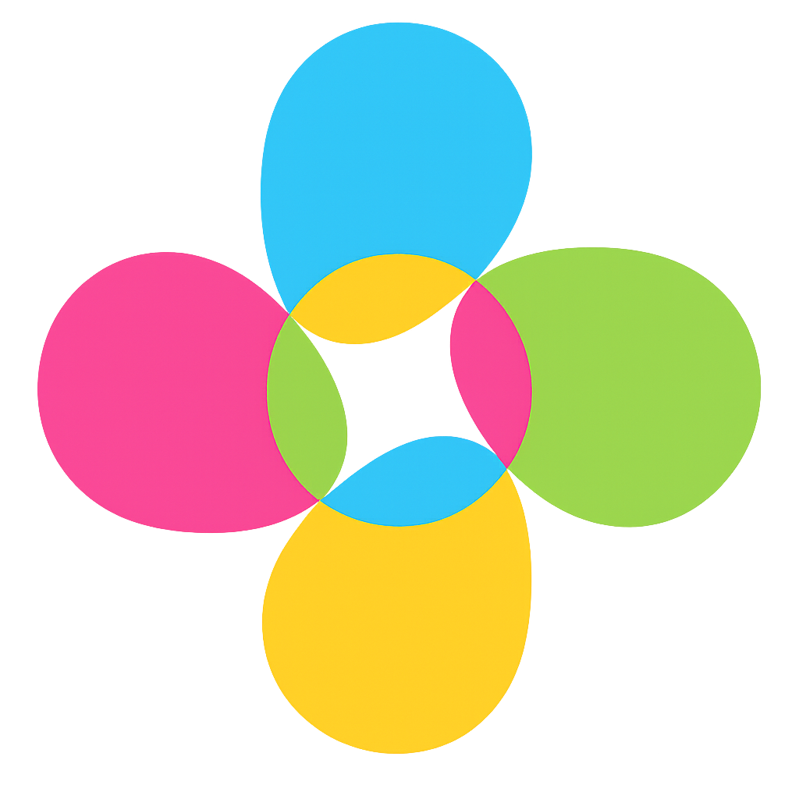

# Horizontal Layout System

Website Anda sekarang menggunakan **satu sistem layout horizontal** yang modern dan clean.

## Layout Horizontal (Top Navigation) - Default
- File: `index.php`
- Layout: `partials/layouts/layoutHorizontal.php`
- Menggunakan navigation bar di bagian atas
- Tampilan modern dan responsive

## Cara Menggunakan Layout Horizontal

### Untuk Halaman Baru:
1. Gunakan include layout horizontal:
```php
<?php
// Your PHP logic here
include './partials/layouts/layoutHorizontal.php'
?>

<!-- Your content here -->

<?php include './partials/layouts/layoutBottom.php' ?>
```

### Untuk Mengubah Halaman Existing:
1. Ganti `include './partials/layouts/layoutTop.php'` dengan `include './partials/layouts/layoutHorizontal.php'`
2. Ganti `include './partials/layouts/layoutBottom.php'` di bagian akhir file

## Fitur Layout Horizontal

### ✅ Navigation Bar
- Logo perusahaan di sebelah kiri
- Menu dropdown yang responsive
- Search bar terintegrasi
- Theme toggle (light/dark mode)
- User menu dengan avatar

### ✅ Responsive Design
- Desktop: Menu horizontal penuh
- Tablet: Menu yang dapat di-collapse
- Mobile: Hamburger menu dengan dropdown

### ✅ Dark Mode Support
- Toggle theme dengan button
- Semua elemen mendukung dark mode
- Theme tersimpan di localStorage

### ✅ Animasi & Interaksi
- Hover effects pada menu
- Smooth transitions
- Loading states
- Keyboard navigation (Ctrl+K untuk search)

## Struktur File

```
partials/layouts/
├── layoutHorizontal.php    # Layout horizontal utama
├── layoutBottom.php        # Penutup layout
└── layoutTop.php          # Layout vertikal (legacy - tidak digunakan)

assets/css/
├── horizontal-layout.css   # CSS untuk layout horizontal
└── style.css              # CSS utama

assets/js/
└── horizontal-layout.js    # JavaScript untuk layout horizontal

index.php                   # Halaman utama dengan layout horizontal
```

## Menu yang Tersedia

### Dashboard
- Main Dashboard
- Analytics Dashboard
- CRM
- eCommerce
- Cryptocurrency
- Investment
- LMS
- NFT & Gaming
- Medical
- Analytics
- POS & Inventory

### Components
- Typography
- Colors
- Button
- Dropdown
- Alerts
- Card
- Carousel
- Avatars
- Progress bar
- Tab & Accordion
- Pagination
- Badges

### Users
- Users Grid
- Users List
- Add User
- View Profile

### Customers
- Customer Management
- New Customer

### Projects
- Project Management
- New Project

### Activities
- Activity Management
- New Activity

### Logs
- Log View

## Customization

### Mengubah Logo
Edit file `partials/layouts/layoutHorizontal.php`:
```html

```

### Mengubah Warna
Edit file `assets/css/horizontal-layout.css`:
```css
:root {
    --primary-color: #667eea;
    --secondary-color: #764ba2;
}
```

### Menambah Menu Baru
Edit file `partials/layouts/layoutHorizontal.php`:
```html
<li class="nav-item dropdown">
    <a href="javascript:void(0)" class="nav-link">
        <iconify-icon icon="your-icon" class="nav-icon"></iconify-icon>
        <span>Menu Baru</span>
        <iconify-icon icon="solar:alt-arrow-down-outline" class="dropdown-arrow"></iconify-icon>
    </a>
    <ul class="dropdown-menu">
        <li><a href="page1.php">Submenu 1</a></li>
        <li><a href="page2.php">Submenu 2</a></li>
    </ul>
</li>
```

## Browser Support
- Chrome 60+
- Firefox 55+
- Safari 12+
- Edge 79+

## Performance
- CSS dan JavaScript dioptimasi untuk performa
- Lazy loading untuk komponen besar
- Minimal reflow dan repaint
- Efficient event handling

## Troubleshooting

### Menu tidak muncul di mobile
- Pastikan file `horizontal-layout.js` ter-load
- Cek console untuk error JavaScript
- Pastikan CSS mobile styles ter-inject

### Theme toggle tidak berfungsi
- Cek localStorage di browser
- Pastikan JavaScript tidak error
- Cek apakah ada conflict dengan script lain

### Logo tidak muncul
- Pastikan path file logo benar
- Cek apakah file logo ada di folder assets
- Pastikan permission file benar

## Migration dari Layout Vertikal

Jika Anda memiliki halaman yang masih menggunakan layout vertikal (sidebar), ikuti langkah berikut:

1. **Ganti include layout**:
   ```php
   // Dari
   include './partials/layouts/layoutTop.php'
   
   // Menjadi
   include './partials/layouts/layoutHorizontal.php'
   ```

2. **Ganti include footer**:
   ```php
   // Dari
   include './partials/footer.php'
   
   // Menjadi
   include './partials/layouts/layoutBottom.php'
   ```

3. **Hapus sidebar references** jika ada

## Support
Untuk bantuan lebih lanjut, silakan hubungi tim development PPSolution.
